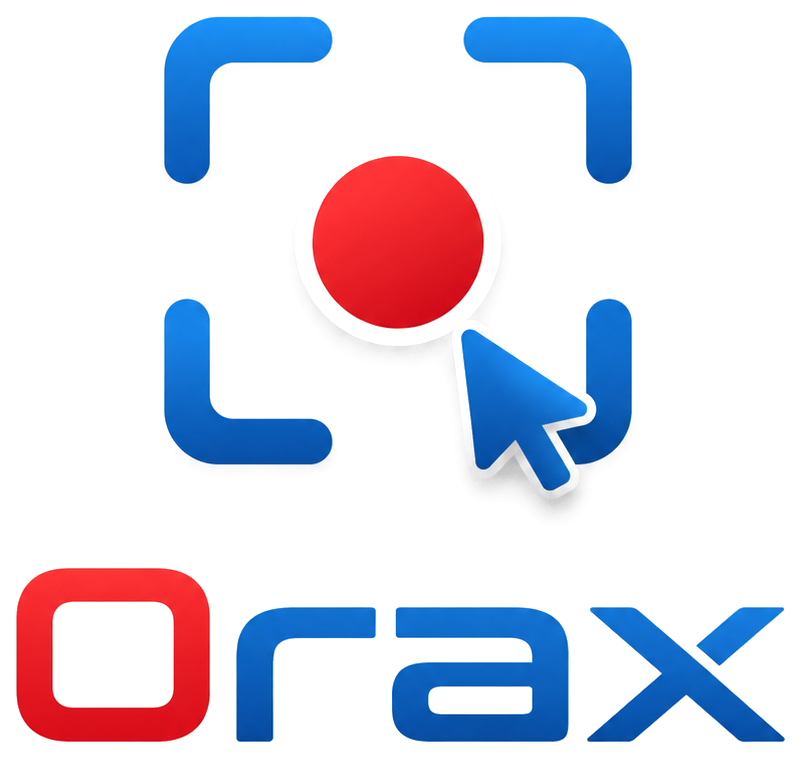
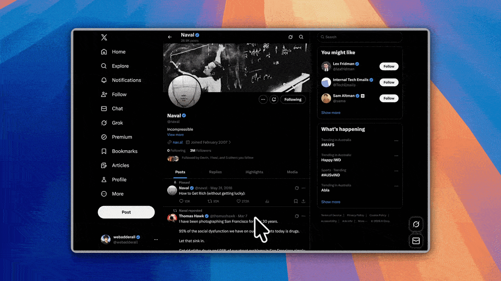

<p align="center">
  
</p>

<h1 align="center">OraxRecordly</h1>

<p align="center">
  
  
</p>

### Create polished demo videos in minutes

[OraxRecordly](https://github.com/Mohammedorax/OraxRecordly) is an **open-source screen recorder** and editor for **walkthroughs, demos, product videos**, and more.

---

## Attribution

**OraxRecordly is a fork and derivative of [Recordly](https://github.com/webadderallorg/Recordly) by [@webadderall](https://x.com/webadderall)**, used under the original project's licence. The original application, its design, and the large majority of this codebase are the work of the Recordly project and its contributors — this fork does not claim that work as its own.

- Upstream project: https://github.com/webadderallorg/Recordly
- Licence (kept intact from upstream): [LICENSE.md](LICENSE.md) — **AGPL 3.0**
- Third-party components and fonts: [THIRD_PARTY_NOTICES.md](THIRD_PARTY_NOTICES.md)

This fork keeps the original licence and credit. Per the upstream licence, it also avoids the "Recordly" name and branding, which is why this project ships as **OraxRecordly**.


---

## What this fork changes

OraxRecordly adds a screenshot workflow, an Arabic-first UI, and a set of native and performance fixes on top of upstream Recordly. Everything else — recording, the timeline editor, cursor tooling, frame styling, and MP4/GIF export — is the upstream feature set described further down.

### Arabic-first UI

- Arabic is the **default language**, with a full **RTL** layout (not just translated strings).
- Exactly two locales ship: **`ar`** and **`en`**. See [TRANSLATION_GUIDE.md](TRANSLATION_GUIDE.md).
- Bundled **Thmanyah Serif Display** Arabic typeface (`src/assets/fonts/thmanyah/`), alongside DM Sans for Latin text. Licensing is documented in [THIRD_PARTY_NOTICES.md](THIRD_PARTY_NOTICES.md).

### Standalone screenshot system

- Capture the **full screen**, a **selected area**, or a **selected source** without starting a recording.
- A fullscreen **region-select overlay** for area captures, with draggable handles and a size readout.
- **Capture delay**, an optional **open-the-editor-after-capture** step, and copy-to-clipboard after capture.
- Global shortcut **`Ctrl+Alt+A`** (system-wide — it works when the app is not focused) and a rebindable/disable option in Settings → Screenshots.
- Configurable **file-name templates** (with a live preview) and a **custom screenshots folder**, both stored in the app's screenshot settings. PNG and JPEG output.

### Screenshot image editor

- Crop and **delete region**, pen, arrow, shapes, **highlight**, **pixelate**, and text.
- **Auto fit** and **centre** helpers, plus full **undo**.
- Lossless **PNG** and **JPEG** save, and copy to the clipboard.

### Dashboard screenshots library

- Saved screenshots are listed in the dashboard's **Screenshots** section.
- Search, reopen in the image editor, reveal in the system file manager, and move to trash.

### Removed features and services

- Removed the **sign-in**, **cloud sharing**, and **feedback** features together with the server services behind them. The app is local-only; there is no account to create.

### Native capture fix (Windows `wgc-capture`)

The Windows Graphics Capture helper used to re-encode one duplicate frame for every missing interval between the last captured frame and the stop timestamp. A stop after a static screen therefore took about as long as the idle span itself — **measured: 20 s idle took 23–42 s to stop, and 40 s idle took over 60 s**. That blew past the app's bounded stop, the helper was killed mid-write, and the MP4 was left without a `moov` atom: the recording was lost and the editor never opened.

The backfill is now capped at a handful of frames and the remaining gap is closed with a timeline jump instead of encoded frame by frame. A stop now takes **0.1–1.3 s regardless of idle length**, and the files are an order of magnitude smaller (**20 s idle clip: 3.1 MB instead of 57.9 MB**).

### Performance work

- Removed the PowerShell/C# window-bounds probe storm — it could run **4–5 concurrent `powershell.exe` processes** while recording a window.
- The HUD window no longer resizes on hover, and the recording indicator no longer repaints the transparent window every frame.
- Cursor-telemetry classification is no longer O(clicks × samples): **1647 ms → 27 ms** for an hour-long recording, and it previously ran twice per project open.
- The waveform pipeline (whole-file fetch plus full audio decode) is now **lazy**, and only runs when a clip actually shows source audio.
- Editor bundle **code-split: 1347 kB → 938 kB** (gzip 399 kB → 266 kB).

### Updates and data

- Auto-updates point at **this fork's own GitHub Releases**, never upstream. See [Publishing a release](#publishing-a-release) and [docs/updates.md](docs/updates.md).
- The user-data folder intentionally stays `%APPDATA%\Recordly` so recordings and settings from an existing install survive the rename.

---

### Backed by the community

<a href="https://coderabbit.link/recordly"></a>

---

## What is OraxRecordly?

OraxRecordly is a desktop app for recording and editing screen captures with motion-driven presentation tools built in. Instead of sending raw footage to a motion designer just to add zooms, cursor polish, or a styled background, OraxRecordly handles that workflow in one place for free.

OraxRecordly runs on:

- **macOS** 14.0+
- **Windows** 10 Build 19041+
- **Linux** on modern distros

Platform notes:

- **macOS** uses native ScreenCaptureKit-based capture helpers.
- **Windows** uses a native Windows Graphics Capture (WGC) helper on supported builds, with native WASAPI audio support.
- **Linux** records through Electron capture APIs. Cursor hiding is not supported on Linux today.

---

# Core Features

## Auto-zooms, cursor polish, and styled frames
OraxRecordly can automatically emphasize activity with zoom suggestions, smooth cursor movement, add motion effects, and place the final composition inside a styled frame with wallpapers, colors, gradients, blur, padding, and shadows.

<p>
  
</p>

Cursor loop mode and cursor sway:

<p>
  
  
</p>

## Timeline editing built for demos
Use drag-and-drop timeline tools for zooms, trims, speed regions, annotations, extra audio regions, and crop-aware edits. Save and reopen work as `.recordly` project files.

<p>
  
</p>

## Extensions & Marketplace

OraxRecordly has a community-driven extension system. Anyone can build and publish extensions that add new capabilities to OraxRecordly — cursor click sounds, device frames, browser mockups, wallpapers, render hooks, settings panels, and more.

Browse and install community extensions from the upstream [Recordly Marketplace](https://marketplace.recordly.dev/extensions), and see [EXTENSIONS.md](EXTENSIONS.md) for the extension API in this fork.

---

## All Features

### Recording

- Record an entire display or a single app window
- Jump directly from recording into the editor
- Capture microphone audio and system audio
- Use native capture backends where supported
- Resume editing from saved `.recordly` project files
- Open existing recordings or existing project files from the app

### Screenshots

- Capture the full screen, a selected area, or a selected source
- Fullscreen region-select overlay with adjustable handles
- Capture delay, file-name templates, and a custom screenshots folder
- Global `Ctrl+Alt+A` shortcut (rebindable or disableable)
- Built-in image editor: crop, delete region, pen, arrow, shapes, highlight, pixelate, text
- Auto fit, centre, and undo
- Save as PNG or JPEG, and copy to the clipboard
- Browse, search, reopen, and trash screenshots from the dashboard

### Timeline and Editing

- Drag-and-drop timeline editing
- Trim unwanted sections
- Add manual zoom regions
- Use automatic zoom suggestions based on cursor activity
- Add speed-up and slow-down regions
- Add text, image, and figure annotations
- Add extra audio regions on the timeline
- Crop the recorded frame
- Save and reopen projects with editor state preserved

### Cursor Controls

- Show or hide the rendered cursor overlay
- Cursor size adjustment
- Cursor smoothing
- Cursor motion blur
- Cursor click bounce
- Cursor sway
- Cursor loop mode for cleaner looping exports
- macOS-style cursor assets for the rendered overlay

### Frame Styling and Backgrounds

- Built-in wallpapers
- Runtime wallpaper discovery from the wallpapers directory
- Custom uploaded backgrounds
- Solid color backgrounds
- Gradient backgrounds
- Frame padding
- Rounded corners
- Background blur
- Drop shadows
- Aspect ratio presets for the final frame

### Export

- MP4 export
- GIF export
- Export quality selection
- GIF frame-rate selection
- GIF loop toggle
- GIF size presets
- Aspect ratio and output dimension controls
- Reveal exported files in the system file manager

### Workflow and Usability

- Arabic-first interface with full RTL layout, plus English
- Customizable keyboard shortcuts
- In-app shortcut reference
- Project persistence for editor preferences
- Faster preview recovery after export

---

# Screenshots

<p align="center">
  
</p>

<p align="center">
  
</p>

<p align="center">
  
</p>

---

# Installation

## Download a build

Prebuilt installers for this fork are published on this repository's releases page:

https://github.com/Mohammedorax/OraxRecordly/releases

On Windows the installer is `OraxRecordly-windows-x64.exe`. Installed builds check that releases page once at launch and offer the update to the user; see [docs/updates.md](docs/updates.md) for how a release is published and the two values a fork must edit to point the updater at its own repository.

---

## Build from source

### Prerequisites

- **Node.js** with npm — a current LTS release (the CI workflows use Node 22).
- **Windows only:** Visual Studio 2022 (or Build Tools) with the **Desktop development with C++** workload, plus **CMake** — required to compile the native `wgc-capture` helper. `npm run build:windows-capture` looks for CMake on `PATH`, in `C:\Program Files\CMake\bin`, and in the VS 2022 bundled CMake, and it uses the existing CMake configure/build flow to stage `electron/native/bin/win32-x64/wgc-capture.exe`.
- **macOS:** Xcode Command Line Tools (`xcode-select --install`) for the native capture helpers.
- **Linux (Ubuntu/Debian):**

  ```bash
  sudo apt install build-essential cmake libx11-dev libxtst-dev libxrandr-dev libxt-dev
  ```

### Install and run

```bash
git clone https://github.com/Mohammedorax/OraxRecordly.git oraxrecordly
cd oraxrecordly
npm ci --ignore-scripts
npm run build:windows-capture   # Windows: build the native WGC capture helper
npm run dev
```

`npm ci --ignore-scripts` installs the exact locked dependency tree without running the `postinstall` hook, which would otherwise rebuild `uiohook-napi` and every platform native helper (`rebuild:native`, `build:platform-native-helpers`). Run the helper you actually need explicitly, as above.

Other helper builds, if you need them:

- `npm run build:native-helpers`
- `npm run build:windows-gpu-export`
- `npm run build:nvidia-cuda-compositor`
- `npm run build:cursor-monitor`
- `npm run build:platform-native-helpers` (all of the above, plus `build:windows-capture`)

### Package

A full packaged build runs TypeScript, the Vite build, the native helpers, the CJS smoke test, and `electron-builder`:

```bash
npm run build        # current platform
npm run build:win    # Windows (NSIS installer)
npm run build:mac    # macOS (dmg + zip)
npm run build:linux  # Linux (AppImage)
```

If `dist/` and `dist-electron/` are already built, packaging on its own is:

```bash
npx electron-builder --win
```

Artifacts land in `release/`; the Windows NSIS installer is `release/OraxRecordly-windows-x64.exe`.

---

## Publishing a release

1. Bump `version` in `package.json`.
2. Build for the platforms you ship.
3. Create the GitHub release for the new tag, then publish the installers **and** the generated update metadata (`latest.yml`, `*.blockmap`, and the macOS `*.zip`/`latest-mac.yml`):

   ```bash
   npm run release:create -- --tag v1.4.1
   npx electron-builder --publish always   # needs GH_TOKEN
   ```

See [docs/updates.md](docs/updates.md) for the full update flow, the two `electron-builder.json5` / `package.json` values that point the updater at this fork, and the override/disable escape hatches.

---

## Arch Linux / Manjaro (yay)

> [!NOTE]
> The AUR packages below track **upstream Recordly**, not this fork, and are maintained by the upstream community. Installing them gives you upstream Recordly. OraxRecordly itself is distributed from [this fork's releases page](https://github.com/Mohammedorax/OraxRecordly/releases).

Install upstream Recordly from the AUR ([recordly-bin](https://aur.archlinux.org/packages/recordly-bin)):

```bash
yay -S recordly-bin
```

PKGBUILD, desktop entry, release sync, and optional **local-from-source** packaging live in **[recordly-aur](https://github.com/firtoz/recordly-aur)**. For maintainer contact and how the package is updated, see that repo or the AUR package page.

---

## macOS: "App cannot be opened"

Locally built apps may be quarantined by macOS.

Remove the quarantine flag with:

```bash
xattr -rd com.apple.quarantine /Applications/OraxRecordly.app
```

---

# System Requirements

| Platform | Minimum version | Notes |
|---|---|---|
| **macOS** | macOS 14.0 (Sonoma) | Required for ScreenCaptureKit audio and microphone capture. |
| **Windows** | Windows 10 20H1 (Build 19041, May 2020) | Required for the native Windows Graphics Capture (WGC) helper and best cursor-hiding behavior. |
| **Linux** | Any modern distro | Recording works through Electron capture. System audio generally requires PipeWire. |

> [!IMPORTANT]
> On Windows builds older than 19041, recording can still work through fallback capture, but the real OS cursor may remain visible in recordings.

---

# Usage

## Record

1. Launch OraxRecordly.
2. Select a screen or window.
3. Choose microphone and system-audio options.
4. Start recording.
5. Stop recording to open the editor.

## Screenshot

1. Use the screenshot button in the app, or press **`Ctrl+Alt+A`** from anywhere.
2. Pick full screen, a selected area, or a selected source.
3. Optionally edit the capture (crop, annotate, highlight, pixelate) in the built-in image editor.
4. Save as PNG or JPEG, or copy it to the clipboard. Saved captures appear under **Screenshots** in the dashboard.

Configure the delay, shortcut, file-name template, format, and folder in **Settings → Screenshots**.

## Edit

Inside the editor you can:

- add trims, zooms, speed regions, and annotations
- tune cursor behavior and preview volume
- style the frame with wallpapers, colors, gradients, blur, padding, and corners
- add extra audio regions
- crop the frame and choose an aspect ratio

Save your work anytime as a `.recordly` project.

## Export

Export options include:

- **MP4** for standard video output
- **GIF** for lightweight sharing and loops

You can adjust format-specific settings such as quality, GIF frame rate, GIF looping, and output size before export.

---

# Limitations

### Cursor capture

OraxRecordly renders a polished cursor overlay on top of the recording. Platform cursor-hiding behavior still depends on OS support.

**macOS**
- ScreenCaptureKit can exclude the real cursor cleanly.

**Windows**
- Best results require Windows 10 Build 19041+ and the native capture helper.
- Older builds fall back to Electron capture, so the real cursor may remain visible.

**Linux**
- Electron desktop capture does not currently support cursor hiding.
- If you also enable the rendered cursor overlay, exports may show both the real cursor and the styled cursor.

### System audio

System audio support varies by platform.

**Windows**
- Native WASAPI support

**Linux**
- Usually requires PipeWire

**macOS**
- Requires macOS 14.0+ and the ScreenCaptureKit-based workflow

---

# How It Works

OraxRecordly combines a platform-specific capture layer with a renderer-driven editor and export pipeline.

**Capture**
- Electron coordinates recording and application flow
- macOS uses native ScreenCaptureKit helpers
- Windows uses a native Windows Graphics Capture (WGC) helper and native audio helpers where available

**Screenshots**
- A dedicated capture path grabs the screen, region, or source
- Area captures run through a fullscreen region-select overlay, and the result opens in the standalone image editor

**Editing**
- Timeline regions define zooms, trims, speed changes, audio overlays, and annotations
- Cursor styling is applied in the editor state

**Rendering**
- Scene composition is handled by **PixiJS**

**Export**
- The same scene logic used in preview is rendered into exported MP4 or GIF output

**Projects**
- `.recordly` files store the source media path plus editor state so work can be reopened later

---

# Contribution

Contributions are welcome.

Areas where help is especially useful:

- Arabic localisation and RTL polish
- Linux capture and cursor behavior
- Export performance and stability
- UI and UX refinement
- Additional editor tools and workflow polish

Please keep pull requests focused, test recording/edit/export flows, and avoid unrelated refactors.

See `CONTRIBUTING.md` for guidelines. Upstream Recordly is at https://github.com/webadderallorg/Recordly.

---

# Community

Bug reports and feature requests for **this fork**:

https://github.com/Mohammedorax/OraxRecordly/issues

Pull requests are welcome.

---

# Hall of Supporters

These supporters backed **upstream Recordly**; the Ko-fi link below goes to the original author, [@webadderall](https://x.com/webadderall).

[](https://ko-fi.com/webadderall)

- Tom Egan @tomegan on X
- Robin Ebers @robinebers on X
- Tadees
- buildwithfur
- piccinato
- Tobias
- Anonymous Supporter
- Tandava Appadoo
- Digitalfastmind
- Roberto Marcelino
- Tony
- Rajan RK
- Francesco
- Erwan
- Anonymous supporter

---

# License

OraxRecordly is licensed under the **AGPL 3.0**, the same licence as upstream Recordly. The original [LICENSE.md](LICENSE.md) is kept intact in this repository. Because the licence does not permit reusing the "Recordly" name or branding, this fork ships under the OraxRecordly name.

---

# Credits

## Acknowledgements

Recordly originally started as a fork of [OpenScreen](https://github.com/siddharthvaddem/openscreen). Over 80% of code has diverged since.
Many features of OpenScreen such as its zoom animations are directly ported from early versions of Recordly.

Created by
[@webadderall](https://x.com/webadderall)

OraxRecordly fork maintained by [Mohammedorax](https://github.com/Mohammedorax). See [THIRD_PARTY_NOTICES.md](THIRD_PARTY_NOTICES.md) for bundled third-party components and fonts.

---
